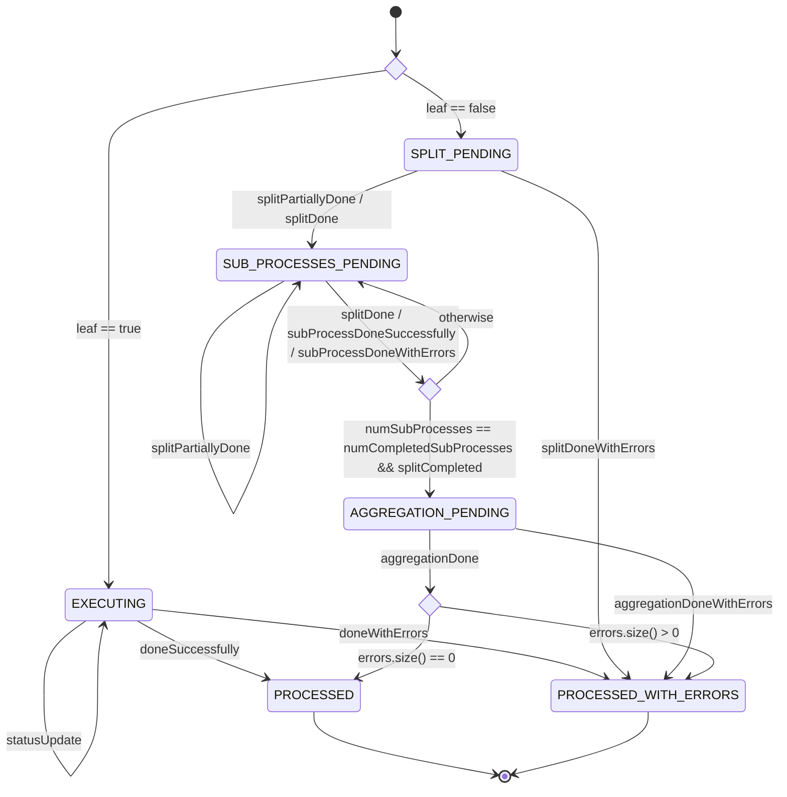

# Chenile Process Management — Guide

Chenile Process Management is a splitter/aggregator (map-reduce) orchestrator built on Chenile's
state-machine (STM) framework. A long-running job is modelled as a tree of `Process` entities: a
non-leaf process splits into sub-processes, each sub-process may split further, leaf processes execute
real work, and results aggregate back up the tree until the root is complete. The flow is declared once
in a state-transition file; the work itself is performed by pluggable workers that run outside the state
machine and report back into it by raising events.

The system is activated through triggers, drives each process through the state machine, launches the
right worker at each step, and emits an event when a process finishes so that downstream processes can be
chained. It runs as a library inside your own Spring application, backed by your own database.

## At a glance

Chenile Process Management orchestrates tree-structured, long-running jobs as data rather than as
procedural code. A trigger raises a `ProcessCreate` event that creates a root `Process`; the state machine
then drives each process according to its type — a leaf process executes directly, a non-leaf process
splits into children, waits for all of them, and aggregates — until it reaches a terminal state
(`PROCESSED` or `PROCESSED_WITH_ERRORS`). Work at each step is performed by a worker (splitter, executor,
or aggregator) that runs outside the machine and reports back by raising events. When a process finishes it
emits a `ProcessCompletedEvent`, from which configured successor processes are created, allowing processes
to be composed in sequence.

The moving parts: **process definitions** describe each type and its worker configuration, sourced from a
JSON file or a database table; **workers** run in one of three interchangeable modes — in-VM, a pub/sub
queue, or a durable JDBC work queue; **triggers** (durable Quartz crontabs, deduplicated through
`trigger_log`) activate the system; and **tenancy** is carried from a framework header through the whole
tree. For deployments that require every consequence of a transition to survive a crash, an opt-in
**transactional outbox** writes each consequence in the same transaction as the state save and executes it
through a dispatcher with at-least-once delivery, consumer-receipt idempotency, lease-fenced claiming,
retry/backoff, dead-letter handling with compensation, and a reference target of PostgreSQL. Everything —
state, definitions, outbox, receipts, and trigger idempotency — lives in the application's own database.

## Modules

The Maven reactor is organised into focused modules.

`process-api` holds the shared model — `Process`, `ProcessDto`, `WorkerDto`, `WorkerType`, the
`Constants` catalogue of states and events, the payload classes, and `ProcessCompletedEvent` — together
with the `WorkerStarter` interface and the configuration abstraction (`IProcessConfigurator`,
`ProcessDef`).

`process-service` is the running service: the STM definition, the transition-action commands,
`ProcessManagerImpl`, `ProcessController`, `ProcessEntryAction`, `PostSaveHook`, the configurators, the
durable-execution wiring, and the Spring configuration.

`process-utils` provides the worker base classes (`SplitterBase`, `ExecutorBase`, `AggregatorBase`,
orchestrated by `BatchServiceBase`) and helpers.

`process-delegate` is a client for invoking the manager remotely.

`process-outbox` is the transactional outbox infrastructure used for durable execution (see below). It is
independent and database-only so that it can be depended on without creating a cycle.

`invm-process-starter`, `q-based-process-starter`, and `jdbc-process-starter` are the three
interchangeable worker launch strategies.

`chenile-trigger` is the activation layer: durable Quartz crontabs and in-JVM trigger events, including
the `ProcessCreate` event that starts a root process.

## The domain model

A `Process` carries the fields that drive orchestration: `leaf` (whether it executes directly or splits),
`processType`, `parentId`, `predecessorId`, `triggerId` (correlation to the activation that
created it), the transient `subProcesses` list used during a split, `splitCompleted`, the counters
`numSubProcesses` and `numCompletedSubProcesses`, `input` and `output` (serialized arguments and result),
an `errors` collection, and the inherited `tenant` from the framework base entity. The current STM state
lives on the entity as well.

## The state machine

The flow is defined in `process-service/src/main/resources/org/chenile/orchestrator/process/process-states.xml`.
States and event names are catalogued in `Constants`.



A new process starts at `isThisLeafNode`, which routes a leaf directly to `EXECUTING` and a non-leaf
to `SPLIT_PENDING`. Processes are created when triggered or when their predecessor completes;
there is no parked state or separate activation event.

A leaf process in `EXECUTING` runs its executor and reports `doneSuccessfully` (→ `PROCESSED`) or
`doneWithErrors` (→ `PROCESSED_WITH_ERRORS`); `statusUpdate` is a self-transition for progress reporting.

A non-leaf process in `SPLIT_PENDING` runs its splitter, which may emit `splitPartiallyDone` repeatedly as
it discovers children and finally `splitDone`; both land the process in `SUB_PROCESSES_PENDING`.

`SUB_PROCESSES_PENDING` is the coordination hub. Each child completion and the final `splitDone` route
through the decision `areAllSubProcessesDone`, whose guard —
`(numSubProcesses == numCompletedSubProcesses) && splitCompleted` — advances the process to
`AGGREGATION_PENDING` only when the split is finalized **and** every child has reported back. Requiring
both halves is what makes streaming/partial splits safe: children may begin finishing before the split is
declared complete without the parent deciding prematurely that it is done.

`AGGREGATION_PENDING` runs the aggregator, which emits `aggregationDone` (→ the `areThereErrors` decision,
which routes to `PROCESSED` or `PROCESSED_WITH_ERRORS` based on the accumulated errors) or
`aggregationDoneWithErrors` (→ `PROCESSED_WITH_ERRORS`). Both `PROCESSED` and `PROCESSED_WITH_ERRORS` are
terminal.

## End-to-end lifecycle

```
Trigger (Quartz crontab, or any adapter)
  → TriggerService.trigger(TriggerInput)         [idempotent on (triggerId, eventId)]
  → EventProcessor.handleEvent("ProcessCreate", ProcessDto, headers)
  → ProcessManagerImpl.create(ProcessDto)         [creates a root; retains trigger correlation]
  → root Process persisted, state machine entered
  → the matching SPLITTER / EXECUTOR / AGGREGATOR worker is launched
  → workers raise events (splitDone, subProcessDoneSuccessfully, aggregationDone, …) back into the STM
  → children created, parents notified, state advances
  → terminal state (PROCESSED / PROCESSED_WITH_ERRORS)
  → ProcessCompleted event emitted → successors chained as new processes
```

## Creating a process

Process creation is an event-driven operation. `ProcessController.create` is annotated
`@EventsSubscribedTo("ProcessCreate")`, so the same operation is reachable through `POST /process` or the
in-JVM `ProcessCreate` event. The request body is a `ProcessDto`:

```json
{ "processDefName": "feed", "args": { "file": "s3://…" }, "triggerId": "crontab:nightly:abc", "description": "Nightly feed" }
```

`ProcessManagerImpl.create(ProcessDto)` requires `processDefName`, serializes `args` into the process
`input`, records the `triggerId` (taken from the payload, or from the `x-chenile-trigger-id` context
header when the payload omits it) for correlation, and drives the new root through the state machine.

`triggerId` on a process is correlation metadata. A direct `POST /process` or a direct `create(ProcessDto)`
call always creates a new root; deduplication of repeated activations is the responsibility of the trigger
layer (described below), not the process manager.

Other controller endpoints: `GET /process/{id}` retrieves a process; `PATCH /process/{id}/{eventID}`
delivers an STM event with a typed payload; `GET /processChildren/{id}` returns the sub-process tree; and
`POST /process/completed` (`@EventsSubscribedTo("ProcessCompleted")`) is the ingress for completion-driven
chaining.

## Workers and launch modes

Each work-pending state has a corresponding worker. `PostSaveHook` resolves the worker type and its
configuration for the current state and hands a `WorkerDto` to the configured `WorkerStarter`:

| State | Worker | Configuration |
|---|---|---|
| `SPLIT_PENDING` | `SPLITTER` | `ProcessDef.config` |
| `EXECUTING` | `EXECUTOR` | `ProcessDef.config` |
| `AGGREGATION_PENDING` | `AGGREGATOR` | `ProcessDef.config` |

Every worker type for a process receives the same `config` map from the process definition (copied, never
mutated). Three interchangeable `WorkerStarter` implementations decide where work actually runs:

- **in-VM** dispatches the `WorkerDto` to the in-JVM `EventProcessor` — simplest, good for tests and small
  flows.
- **queue-based** publishes to a Chenile pub/sub topic named in the `execDef`, forwarding the tenant as
  `x-chenile-tenant-id` when present.
- **JDBC** inserts a durable `chenile_process_work_item` row (idempotency key, `FOR UPDATE SKIP LOCKED`
  claim, lease, attempt/retry, `DEAD` after the maximum attempts); a runner polls and executes. This is
  the production-grade, KEDA-scalable option.

Workers extend the `process-utils` base classes, which handle payload typing, tenant propagation into the
Chenile context, and error reporting back to the daemon.

## Process definitions

A process definition (`ProcessDef`) describes a `processType`: whether it is a `leaf`, its
`parentProcessType`, its predecessor relationship for chaining (`predecessorProcessType`,
`predecessorArgs`), and a single `config` map shared by all of its worker types. Definitions are resolved
through `IProcessConfigurator.findByName`, with the source selected by property:

- `chenile.process.configurator=json` (default) — read from a JSON resource (`def.json`).
- `chenile.process.configurator=database` — read from the `process_definition` table, deserializing the
  stored JSON into `ProcessDef` on each lookup. This allows definitions to be managed at runtime without
  redeploying.

## Durable execution (transactional outbox)

For deployments that need every consequence of a transition to survive a crash, Process Management offers a
transactional outbox, enabled with `chenile.process.outbox.enabled=true`. When enabled, `ProcessEntryAction`
does not perform its side effects inline; instead each consequence is written as a row in
`chenile_process_outbox` **in the same database transaction that saves the `Process`**, and a dispatcher
drains and executes them. State change and its scheduled consequences therefore commit atomically or not at
all.

The entry action uses the same registered commands whether durability is enabled or not: it saves the
process and delegates to `ProcessEffects`. `ProcessCommandSupport` either persists the command as JSON for
durable dispatch or, when durability is disabled, invokes it immediately with a live typed body — inline
mode needs no outbox schema or receipts and preserves synchronous cascades. Parent notification is a
`SignalParentCommand`, and worker planning and launch use a prepare/dispatch split.

Four command types cover the consequences of a transition:

| Command | Effect |
|---|---|
| `CREATE_SUBPROCESS` | create a child process |
| `SIGNAL_PARENT` | deliver `subProcessDoneSuccessfully` / `subProcessDoneWithErrors` to the parent |
| `EMIT_COMPLETED` | run framework chaining and best-effort subscriber fan-out |
| `START_WORKER` | hand a serialized `WorkerDto` to the configured starter |

Key properties of the mechanism:

- **Enqueue joins the caller's transaction.** `ProcessOutboxRepository.enqueue` participates in the active
  transaction (and asserts one is present), so a rolled-back transition leaves no orphaned command.
- **Claim-token fencing.** Each claim stamps a fresh token under a lease; a stale claimant whose lease
  expired and was reclaimed cannot run the handler, acknowledge, or fail the reclaimed work. Claims use
  `FOR UPDATE SKIP LOCKED`.
- **Consumer receipts.** A `chenile_process_receipt` row is committed atomically with the effect and the
  acknowledgement, so redelivery is a no-op. Parent counting uses a receipt on parent/child identity so a
  child is counted exactly once regardless of redelivery.
- **Retries and dead-letter.** Failures retry with exponential backoff up to a maximum attempt count, then
  become `DEAD`, surfaced through `deadCount()` and available for operator `replayDead(id)`. A dead
  `START_WORKER` is auto-compensated by driving its process to the error terminal
  (`splitDoneWithErrors` / `doneWithErrors` / `aggregationDoneWithErrors` by worker type) so a worker that
  will never run does not park its subtree.
- **Draining.** A scheduled poller drains due commands (`drainAll`); it can also be driven explicitly in
  tests. Durable creation does not promise the whole cascade has finished when the call returns — the
  cascade completes as the poller drains.

Effects that cannot be committed on the shared datasource — a broker publish from the queue-based starter,
or the after-commit subscriber fan-out — are at-least-once; their receivers must deduplicate (workers on
`WorkerDto.dispatchId`). The outbox targets PostgreSQL as its reference database. See
[process-outbox.md](process-outbox.md) for operational detail and
[adr/0001-durable-outbox-for-process-entry-action.md](adr/0001-durable-outbox-for-process-entry-action.md)
for the design rationale.

## Triggering

`chenile-trigger` converts an external activation into a synchronously dispatched in-JVM Chenile event; it
does not introduce another event bus. A `TriggerInput` (trigger id, event id, payload, headers, time) is
recorded, converted to the declared Java event type, and passed to `EventProcessor`. The trigger id plus
event id form an idempotency claim.

Idempotency is enforced by `TriggerLog` (the `trigger_log` table), whose only columns are `id`,
`trigger_id`, `event_name`, `trigger_time`, and `status`, with a unique constraint on
`(trigger_id, event_name)`. Competing dispatches cannot both claim the same pair; a duplicate is detected
and suppressed in every status, and failed claims are not automatically retried. Claims and status updates
run in independent transactions so they survive the surrounding event transaction.

The shipped adapter is a durable Quartz crontab (`chenile_crontab`, managed through `CrontabService`;
saving or deleting a row registers or removes its Quartz job, and enabled crontabs are rescheduled on
application start). Each firing supplies a stable trigger id of the form
`crontab:{id}:{quartzFireInstanceId}`, so duplicate dispatches are suppressed while each scheduled run
remains distinct. A `ProcessCreate` crontab stores its `ProcessDto` as the event payload.

## Multi-tenancy

Tenant identity comes from the framework: the `x-chenile-tenant-id` header is persisted as the inherited
`BaseJpaEntity.tenant`, is propagated to sub-processes and into the worker execution context, and is
carried on completion events so chained processes and subscribers run under the same tenant.

## Completion and chaining

When a process reaches a terminal state it emits a transport-neutral `ProcessCompletedEvent` carrying
`processId`, `processType`, `tenantId`, `triggerId`, `state`, `input`, `output`, and a `successful` flag.
A process definition declares a predecessor relationship (`predecessorProcessType`, `predecessorArgs`), and
on completion the matching successors are created as new processes — the mechanism for composing one
process after another. Under durable execution this chaining is part of the completion command's
transaction, while delivery to arbitrary application subscribers is best-effort after commit.

## Configuration reference

| Property | Default | Meaning |
|---|---|---|
| `chenile.process.configurator` | `json` | `json` or `database` definition source |
| `chenile.process.outbox.enabled` | `false` | enable durable transactional outbox |
| `chenile.process.outbox.run-dispatcher` | `true` | run the draining poller on this instance |
| `chenile.process.outbox.poll-interval-millis` | `1000` | poller interval |
| `chenile.process.outbox.lock-seconds` | `300` | outbox command lease duration |
| `chenile.process.outbox.max-attempts` | `5` | retries before a command is `DEAD` |
| `chenile.process.outbox.worker-id` | hostname | claimant identity for leases |

## Testing

Integration tests (`TestFeeds`, `TestFile`, `TestChunks`) drive the full recursive feed→file→chunk cascade
with fake workers resolved by naming convention, in both synchronous and latch-stepped asynchronous modes.
`ProcessManagerImplTriggerTest` covers `ProcessDto` creation and trigger correlation. BDD/REST suites drive
the transition matrix over the REST surface. `DatabaseProcessConfiguratorTest` checks the database
configurator. The `chenile-trigger` tests cover dispatch, typed payloads, and the `trigger_log` uniqueness
guarantee. The `process-outbox` tests cover rollback-together, idempotent enqueue, `SKIP LOCKED`, backoff,
retry-then-DEAD, dead-letter compensation, and replay-safe parent counting, with an opt-in suite that runs
the same guarantees against a real PostgreSQL instance. The durable integration tests in `process-service`
exercise the outbox end to end.
